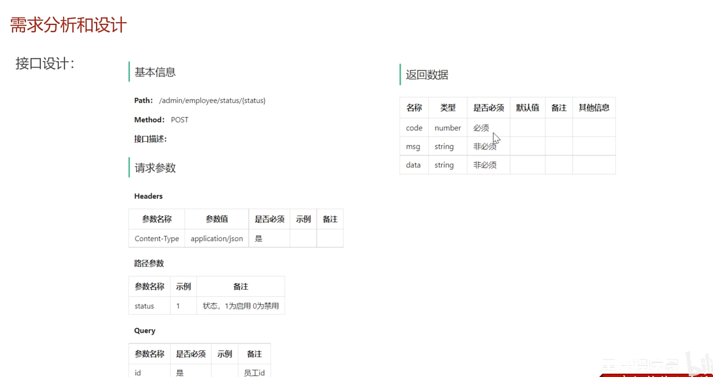

# 启用禁用员工账号

# 1. 需求分析



# 2. Controller层

前端使用post方法发送status和id，其中status在路径中体现。

```java
@PostMapping("/status/{status}")
    @ApiOperation("启用禁用员工账号")
    //注解pathVariable表示这个参数是由路径传递的。
    public Result startOrStop(@PathVariable Integer status, Long id){
        log.info("启用禁用员工账号: {}, {}", id, status);
        employeeService.startOrStop(status, id);
        return Result.success();
    }
```

# 3. Service层

实现此功能本质上是调用update更新数据库employee表中的status字段，所以service层没有什么逻辑功能，但是为了保证我们的mapper层的update语句具有复用性，我们可以将status和id封装成employee对象传传到mapper层。

```java
@Override
    public void startOrStop(Integer status, Long id) {
        Employee employee = Employee.builder().status(status).id(id).build();
        employeeMapper.update(employee);
    }
```
