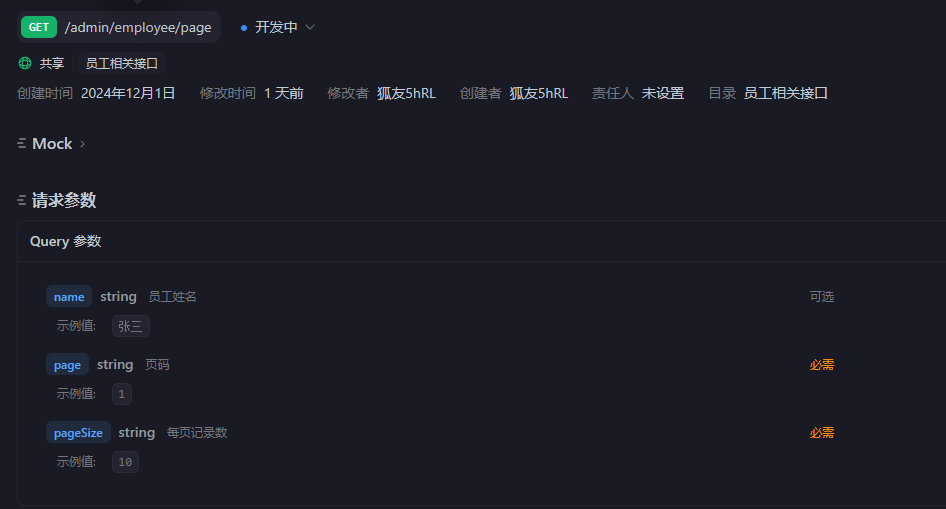
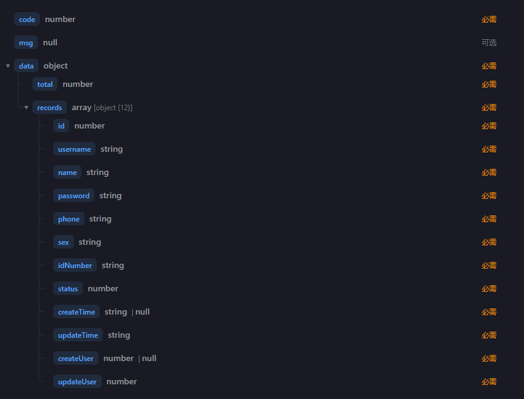

# 员工分页查询

# 1. 需求

## 1.1 请求参数



## 1.2 返回响应



# 2. cotroller层

因为这里是get方法，所以使用GetMapping注解。

```java
@GetMapping("/page")
@ApiOperation("员工分页查询")
public Result<PageResult> page(EmployeePageQueryDTO employeePageQueryDTO){
    log.info("员工分页查询，参数为：{}", employeePageQueryDTO);
    PageResult pageResult = employeeService.pageQuery(employeePageQueryDTO);
    return Result.success(pageResult);
}
```

# 3. service层

使用pagehelper包，向pagehelper的start方法中传入page页码，以及每页记录数即可自动分页。

```java
/**
     * 员工分页查询
     * @param employeePageQueryDTO
     * @return
     */
    @Override
    public PageResult pageQuery(EmployeePageQueryDTO employeePageQueryDTO) {
        //使用pagehelper
        PageHelper.startPage(employeePageQueryDTO.getPage(), employeePageQueryDTO.getPageSize());
        //返回一个page对象，page对象是在pagehelper中定义好的
        Page<Employee> page = employeeMapper.pageQuery(employeePageQueryDTO);

        long total = page.getTotal();
        List<Employee> records = page.getResult();
        return new PageResult(total, records);
    }
```

# 4. mapper层

因为这里需要使用动态sql所以不再使用注解的方式写sql，而是使用mybatis，具体sql语句如下：

```xml
<mapper namespace="com.sky.mapper.EmployeeMapper">
    <select id="pageQuery" resultType="com.sky.entity.Employee">
        select * from employee
        <where>
            <if test="name != null and name != ''">
                and name like concat('%', #{name}, '%')
            </if>
        </where>
        order by create_time desc
    </select>
</mapper>
```

这里if中使用了and是为了保证拼接时语法正确性。语句拼接的结果有以下两种情况：

- name不为空，这样SQL语句变成：
  ```sql
  select * from employee
  where and name like concat('%', #{name}, '%')
  order by create_time desc
   select * from employee where and name like concat('%', #{name}, '%') order by create_time desc
  ```
  where后面多了一个and，但是由于\<where>的机制，mybatis会自动的将多余的and删除。
- name为空时，SQL语句变成：
  ```sql
  select * from employee
  order by create_time desc

  ```
  没有问题。

# 4. 优化日期显示

## 4.1 使用注解方式

通过加入jsonformat注解，如下：

```java
@JsonFormat(pattern = "yyyy-MM-dd HH:mm:ss")
    private LocalDateTime createTime;

@JsonFormat(pattern = "yyyy-MM-dd HH:mm:ss")
  private LocalDateTime updateTime;
```

`@JsonFormat(pattern = "yyyy-MM-dd HH:mm:ss")` 是 Jackson 库中用于格式化 JSON 数据中日期和时间字段的注解。它指定了日期/时间的格式，在序列化（Java 对象转 JSON）和反序列化（JSON 转 Java 对象）时都生效。

## 4.2 在WebMvcConfiguration中配置

自己定义一个转换器用来序列化和反序列化操作，代码如下：

```java
/**
     * 扩展Spring MVC框架的消息转换器
     * @param converters
     */
    @Override
    protected void extendMessageConverters(List<HttpMessageConverter<?>> converters) {
        log.info("扩展消息转换器");
        //创建一个消息转换器对象
        MappingJackson2HttpMessageConverter converter = new MappingJackson2HttpMessageConverter();
        //需要为消息转换器设置一个对象转换器，对象转换器可以将java对象序列化为json数据
        converter.setObjectMapper(new JacksonObjectMapper());
        //将自己的消息转换器加入容器中,0表示优先级最高
        converters.add(0, converter);
    }
```
