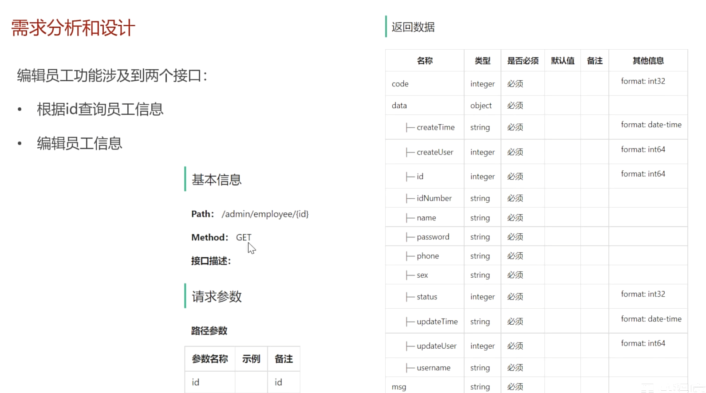

# 编辑员工

# 1. 需求分析

## 1.1 根据id查询员工信息



## 1.2 编辑员工信息


# 2. service层

## 2.1 根据id查询员工信息

这里需要隐藏员工登录密码，代码如下：

```java
@Override
    public Employee getById(Long id) {
        Employee employee = employeeMapper.getById(id);
        employee.setPassword("****");
        return null;
    }
```

## 2.2 编辑信息

这里需要将employeeDTO封装成employee对象，所以需要使用对象的属性拷贝。同时我们需要获取当前操作的用户的id，在新增员工那一个功能中，我们已经将JWT身份校验拦截器还原的id放入ThreadLocal中了，现在只需要调用getCurrentId就可以取出来了。

```java
@Override
    public void update(EmployeeDTO employeeDTO) {
        Employee employee = new Employee();
        //对象的属性拷贝
        BeanUtils.copyProperties(employeeDTO, employee);
        //同时需要额外设置employee的更新时间
        employee.setUpdateTime(LocalDateTime.now());
        employee.setUpdateUser(BaseContext.getCurrentId());
        employeeMapper.update(employee);
    }
```
